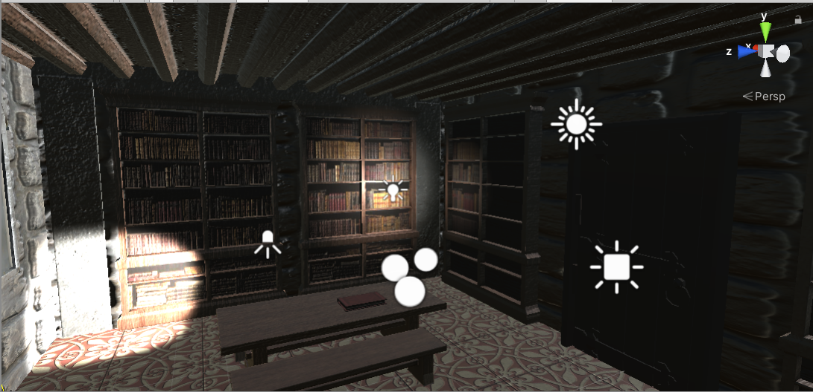
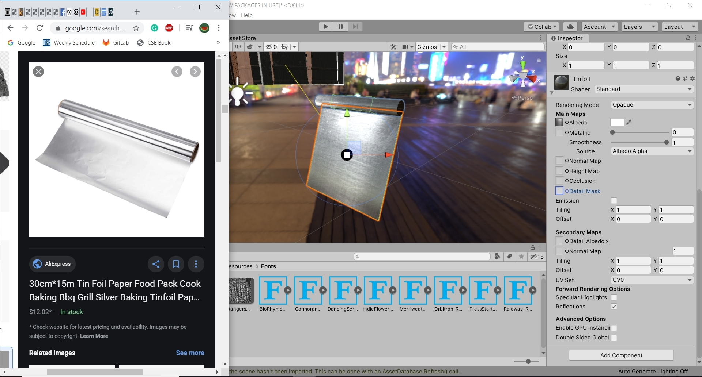

# CMPM163Labs
# Lab 2

Video Link: https://drive.google.com/file/d/1t84B-b09Ai4Ykd5uRjL8FTVjrODAmkkm/view?usp=sharing

3D Models

# Lab 3

Video Link: https://drive.google.com/open?id=18iwITZxRHtc2IiP64Ot5PgEDSZUBYVNF

The first cube on the top was made by mixing two colors smoothly with the frag shader.
The second on the top was made with mixing two colors discretely twice. The image is made up four color parameters, but multiplied in a way were they mixed concretely.

# Lab 4

Questions:

a. floor (u * 8)

b. floor (v * 8)

c. White, (floor(.375 * 8),floor(.25 * 8)) = (3,2) -> White

Video Link: https://drive.google.com/open?id=1aDVFWVXTnWgCfvl6sSNx9OI-NqwKr1yy

I made the three middle cube doing the same thing instructed in the tutorial. Adding a texture using three's in built texture loader. For the right cube, I loaded it in using the shaders from the pervious lab as a template. Because of this, it isn't effected by the lights in the scene. The left cube is implemented using the in-script method for shaders. I also made the 2x2 grid for the texture by multiplying the uVu by 2 but keeping it in the ranges of 0-1. Only coming back to 1 once it passes the 0.5 mark.

# Lab 5

Video Link: https://drive.google.com/open?id=10KciVECCt6IIMnYHd-EQeWBN1GpHggw3

There are a few things I added to the Unity Scene and particle effects. The particle effect increases in emission rate depending on the speed of the kart. I added trails to the kart. And the particle effects also have colliders, so they bounce off of walls and ground. I extended the scene to the further down and let the player hop with the space button 

# Lab 6

Examples of lights and textured objects in the scene. There is a wooden texture on the tables and bookcases. And there is a tiled texture on the floor

Point Light: A light that eminates from one point. Rotating the light has no effect on the output
Spotlight: A light that is directed in a cone shape toward a direction. Position and rotation effect it
Directional Light: A light source that hit every object in the scene in a particular direction. Position has no effect on it
Area Light: a light at directs light in a given direction. Similar to a directional and spotlight, but must be baked into the scene.

Image of created material and added skybox

I made the object look like Tinfoil by getting first getting a metalic texture/color. Then I adjusted the reflection and coloring so that it shined from light. Shown in the picture. I opted to use a texture instead of mainly color since tinfoil looks unnatural if it was completely perfect. The skybox in the scene is a city skybox. THe image shows what it looks like looking down into it

# Lab 7

Video Link: https://drive.google.com/open?id=1Sq0wCbEaizEtsQDtv1NW6xmctnsX68KZ

I created my scene by positioning the respective planes and camera to give the look of a mountain range with lakes. The mountains also included adjustable snow and color to give it a green to white look. I also adjusted the emission color of the mountains so they are pure black as it is in default. All of these color adjustments created a pale and cool color pallete.
