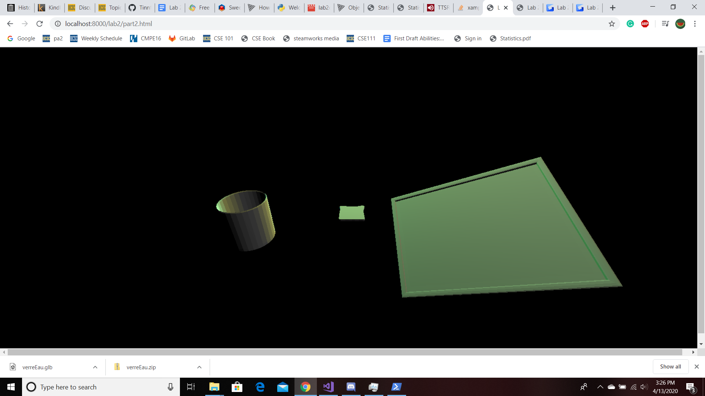

# CMPM163Labs
# Lab 2

Video Link: https://drive.google.com/file/d/1t84B-b09Ai4Ykd5uRjL8FTVjrODAmkkm/view?usp=sharing

3D Models

# Lab 3

Video Link: https://drive.google.com/open?id=18iwITZxRHtc2IiP64Ot5PgEDSZUBYVNF

The first cube on the top was made by mixing two colors smoothly with the frag shader.
The second on the top was made with mixing two colors discretely twice. The image is made up four color parameters, but multiplied in a way were they mixed concretely.
